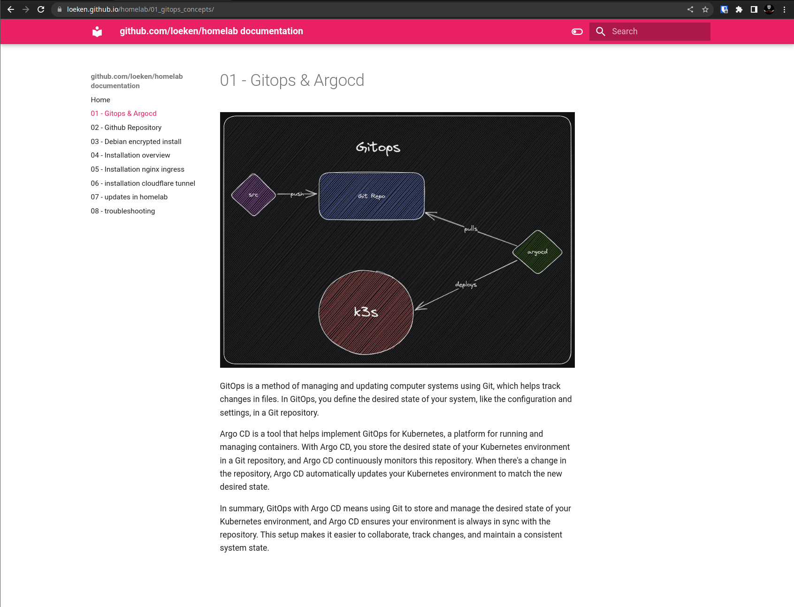

# Homelab
This repo contains definitions for a k3s-based kubernetes (atm-single node) cluster that uses argocd and GitOps principles to deploy the applications running in the cluster. 

## three choices to install


## pre-requisits
- either a dedicated "server", a vm (debian 11) or just minikube
- hardware wise it requires 8GB of ram to run the entire stack ( without load ), recommended 16GB+
- a [github](https://github.com) account to store your configs/secrets
- some apps require an email to send with, such as authelia and nextcloud.

## impatient install
```
git clone https://github.com/loeken/homelab
cd homelab/setup
./setup check-dependencies -h
./setup github -h
./setup install -h
```
a more comprehensive docs on how to install can be found [on the external docs page](https://loeken.github.io/homelab) or [in github's markdown](https://github.com/loeken/homelab/blob/main/docs/index.md)

## features
- made with love
- uses kubernetes (k3s) and containers
- supports full disk encryption ( debian/cryptsetup )
- automated updates via [homelab-updater](github.com/loeken/homelab-updater)
- uses a mix of go/terraform/bash to create the cluster
- ships with a ./setup helper ( written in go )
- modular architecture, easy to add or remove features/components ( PRs welcome )
- bootstraps hypervisor ( proxmox ), with templates ( debian ) and kvms ( k3s )
- follows **gitops** principles
- automated certificate management with cert-manager
- automated ip management with external-dns
- supports external storage ( iscsi/nfs ) such as truenas provides via democratic-csi
- if no external storage provided it configures nfs server/provisioner for ReadWriteMany
- ingress via nginx or cloudflare tunnels
- contineous delivery with **argocd**
- log solution with grafana's loki
- secrets encrypted with **sealed secrets**
- backups & disaster recovery with **kasten k10**
- uses this repo as upstream to receive updates
- replaces the need for a cloud
- two factor / SSO with authelia
- covers your media needs with jellyfin/jellyseer/prowlarr/radarr/sonarr/nzbget/rtorrent
- documentation with obsidian ( ./docs ) or [online](https://loeken.github.io/homelab)

## installation & docs
docs are written in obsidian markdown inside the [docs](./docs) folder, an online version can be found [here](https://loeken.github.io/homelab/) 

[](https://loeken.github.io/homelab)

you can also access it via [github](https://github.com/loeken/homelab/blob/main/docs/index.md)

# The stack from bottom to top
These are all the apps that are part of this repo and can be installed via the ./setup util. It can either be installed in baremetal debian, in proxmox ( setup converts debian to proxmox & creates templates/kvms ). This allows intalling debian with FullDiskEncryption :luc_lock: easily with the debian installer.

| Name                    | Type                    | Description                                      | Optional |
| ----------------------- | ----------------------- | ------------------------------------------------ | -------- |
| Proxmox                 | Operating System        | Allows running KVMs, ships with Webui            | yes      |
| Debian 11               | Template                | Template for Proxmox KVMs                        | yes      |
| KVM                     | Virtual Machine         | A virtual machine ( KVM ) in Proxmox             | yes      |
| k3s                     | Kubernetes Distribution | For self hosting Kubernetes                      | yes      |
| Minikube                | Kubernetes Distribution | Alternative to Baremetal/Proxmox                 | yes      |
| Argocd                  | Kubernetes Application  | Declarative Githubs CD                           | no       |
| Bootstrap Core apps     | Argocd App of Apps      | Used to load required Kubernetes Applications    | no       |
| Bootstrap Optional apps | Argocd App of Apps      | Used to load required Kubernetes Applications    | no       |
| Sealed Secrets          | Kubernetes Application  | Encryption of all application credentials        | no       |
| Cert Manager            | Kubernetes Application  | X.509 certificate controller ( letsencrypt )     | yes      |
| Import Sealed Secrets   | Kubernetes Application  | a helm chart to import stored sealed secrets     | yes      |
| Authelia                | Kubernetes Application  | SingleSignOn Multi-Factor portal                 | yes      |
| Cloudflare Tunnels      | Ingress                 | Alternative ingress using cloudflare tunnels     | yes      |
| Democractic CSI         | Kubernetes Application  | Storage class for iscsi/nfs works with truenas   | yes      |
| External DNS            | Kubernetes Application  | For updating DNS records such as cloudflare      | yes      |
| Home Assistant          | Kubernetes Application  | Open source home automation. Privacy focussed    | yes      |
| Jellyfin                | Kubernetes Application  | Software for streaming videos                    | yes      |
| Jellyseerr              | Kubernetes Application  | Portal for managing download requests            | yes      |
| Kasten K10              | Kubernetes Application  | Backup & Restore, DR and offsite - backblaze b2  | yes      |
| Loki                    | Kubernetes Application  | Grafana & Loki, loads dashboards for linkerd     | yes      |
| Nextcloud               | Kubernetes Application  | Self hosted Dropbox, apps for ios/android        | yes      |
| NFS Provisioner         | Kubernetes Application  | NFS provisioner for local-path for shared-media  | yes      |
| NGINX Ingress           | Ingress                 | Main recommended Ingress controller              | yes      |
| Nzbget                  | Kubernetes Application  | Usenet Downloader                                | yes      |
| Prowlarr                | Kubernetes Application  | Indexer for Usenet/Torrent Trackers              | yes      |
| Radarr                  | Kubernetes Application  | Movie Collection Manager for Usenet/Torrents     | yes      |
| Sonarr                  | Kubernetes Application  | TV Collection Manager for Usenet/Torrents        | yes      |
| Vaultwarden             | Kubernetes Application  | Rust based bitwarden, Password Manager           | yes      |
| Volume Snapshots        | Helm Chart              | Adds snapshot support for democratic-csi         | yes      |
| Whoami                  | Kubernetes Application  | a simple go app to display http requests/headers | yes      | 

