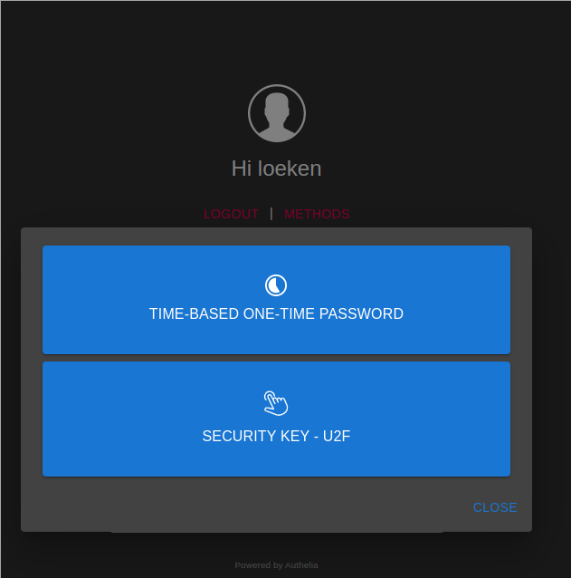

## authelia

"Authelia is an open-source authentication and authorization server providing two-factor authentication and single sign-on (SSO) for your applications via a web portal"

We use it for the two factor part. The first time accessing it you login with your ldap username/password. After the first login click on Methods this would bring you to the following screen:

I highly recommend you to buy yourself a yubikey ideally one that works with your phones and pcs. this is far more conventient to use.

usb-c:      https://www.yubico.com/de/product/yubikey-5c-nfc/
normal usb: https://www.yubico.com/de/product/yubikey-5-nfc/

if this is not an option go for time-based one-time-passwords. for this i recommend the app "google authenticator" as it's available cross platform. you can see the links to the apps when you enroll.

you use your phone, scan this qr code with google authenticator, afterwards it will display you a code, you enter this code in the authelia dashboard and the phone is linked to authelia.

upon successful login you will be redirected to the hub, which links to all other services.
in the next step visit ltb-passwd, to set your ldap password. 