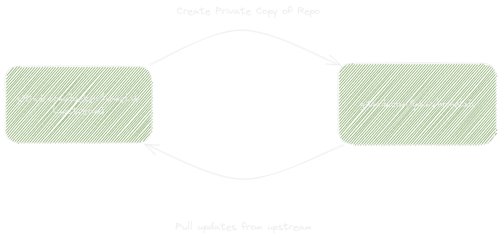

# 07 - updates in homelab

along github.com/loeken/homelab there is also github.com/loeken/homelab-updater.

In this repo there is a github action that has a list of all the charts, docker images and docker image versions that are used by github.com/loeken/homelab. This action is executed at least once a day and it connects to all repos containing the software, it extracts the last release/tag and compares against github.com/loeken/homelab if a new update is found it will create a pull request on github.com/loeken/homelab and github.com/loeken/homelab-repo allowing me to review/test/merge that version bump and merge it back into master on github.com/loeken/homelab. Some of the charts/images used are also maintained by me in github.com/loeken/helm-charts and a few other repos for individual docker images, those repos are also patched and new builds for the docker images are kicked off via github actions.
The github actions in github.com/loeken/homelab-updater also use snyk/trivy to perform basic security checks.



Now that you know how updates end up in github.com/loeken/homelab all you need to do is pull these changes into your repo. For this ( as described in [[02_github_repository]] ) github.com/loeken/homelab is configured as a so called "upstream" in your repo. So all you need to do to fetch changes from my repo is

```bash
git pull upstream main
```

this will pull all updates from my repo and merge them into your repo. This is also why my repo always ships with secrets.yaml.example and values.yaml.example. The example extension is added so when you pull updates changes to the configs will not conflict with your changes.

Now that you have the changes local you now need to send them to github ( and thus to argocd )

```bash
git push
```
