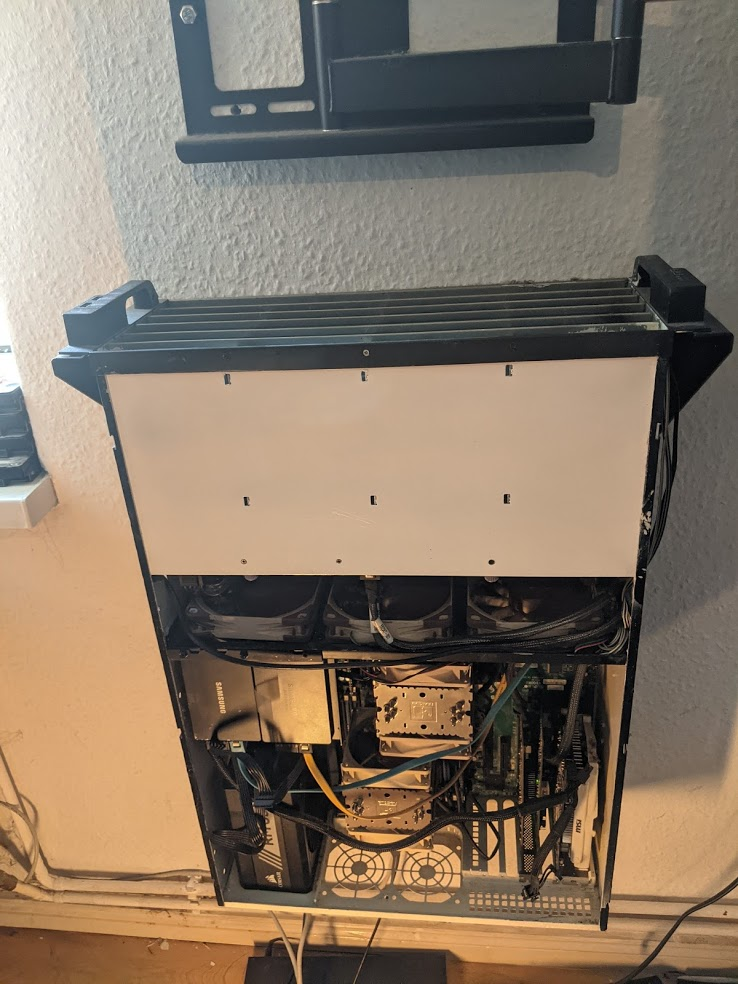

# homelab enduser

## introduction

this document describes the generic setup for example.com

Right now the homelab is running on 32 cores with 96GB of ram with 4 disks a 4TB. These disks form a zfs pool to mirror data ( prevent disk failure/prevent bit rod ) - which gives us a total storage of 8TB to begin with ( 24 hdd slots in this case so upgradable down the line ). this should prevent any local loss of data.

Anybody should ideally follow the 3-2-1 backup rule Rule, as I like to explain it, states the following:

**There should be 3 copies of data on 2 different media with 1 copy being off site ( physically somewhere else ).**

To achive this I am running all applications running on this cluster in containers, all the containers use 2 ways to store their data on the hard disks. I then use a functionality called "volumesnapshots" to create point-in-time restore points which allows me to fully return the data to the state of when that snapshot was taken. Another feature of the software i'm using to schedule/run these snapshotexports is offsite backups. After some research i ended up deciding for [backblaze b2 cloud storage](https://www.backblaze.com/b2/cloud-storage.html) clear pricing of 5$ per TB/month ( all data that is backed up is encrypted locally before backed up ).

## the hub
the hub is a small dashboard ( heimdall ) linking too all services available to the enduser you can reach it via https://hub.example.com/ and you will see it link to the following systems:

### Authelia
Authelia is a "two factor" system. On more important parts of the cluster ( such as personal photos/videos/documents/passwords ) I added a two factor check. so your username&password are not enough and you need to proof your identity via secondary method ( ideally from another device ).

a bit more details on setup of authelia can be found [here](authelia/README.md)

this is the first thing you should setup

### Ldap password
Lightweight Directory Access Protocol: this is a linux username/password service which allows us to use one set of username/passwords across a variety of services. Once you get invited to the cluster you get a username/password go to this platform to set a new password that is only known by you and hasnt been used on any other website

### Vaultwarden
Vaultwarden is my favorite password manager. It works great across Windows/Mac/Linux/Android/iOS you can use it as an addition to apple/google's password manager or fully replace them ( it also supports faceunlock/fingerprints etc).

It works by the user creating a vault and defining a masterpassword. this masterpassword is then used to encrypt all other passwords. so only the person holding the masterpassword can use the passwords.

a bit more details on setup of vaultwarden can be found [here](vaultwarden/README.md)

### Nextcloud
Similar to dropbox but more functionality. you can use it to sync files ( such as photos/videos/documents ) from android/ios/linux/mac/windows to the nextcloud storage ( which in turn is then being backed up weekly to backblaze ).

### Plex
A media streaming platform for movies/tv

### Overseerr
A frontend to request movies/tv that are not yet in the plex library - an automated system will download/unpack these files and move into plex