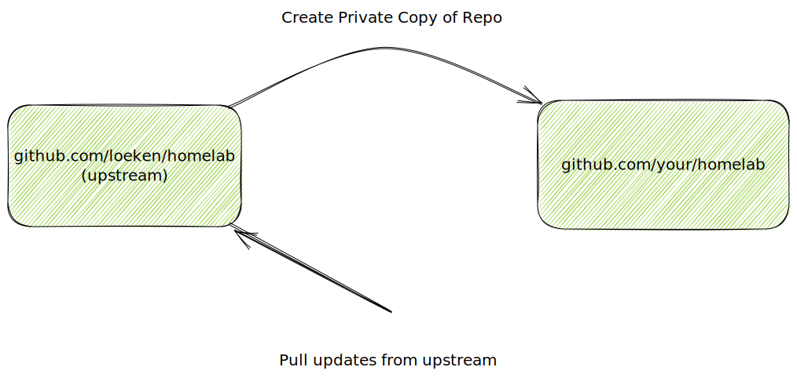

# Github Repository

github.com/loeken/homelab is the repo containing my setup. The first thing that you should do is to grab a local copy of it

```bash
git clone https://github.com/loeken/homelab
cd homelab
```

Everybody has different needs, not everybody wants to run all applications. This means that everybody will need different files in their repositories. So the first step would be to create a private copy of my homelab repository. And then we'll point the newly created repo to use github.com/loeken/homelab as an upstream. This allows to fetch any updates in the future from the main repository.




This might sound more complicated then it as as the ./setup will do most of the work for you. Let's say you picked the new github repo your/homelab. Let's first see if all dependencies needed for running 

```bash
cd setup
./setup check-dependencies --new_repo your/homelab
there is a helper script for ubuntu ./dependencies_ubuntu2204.sh to install dependencies
gh is available
cloudflared is available
git is available
terraform is available
kubectl is available
sshpass is available
kubeseal is available
k3sup is available
You are logged in with the GitHub CLI (gh)
we can write to github via ssh
Git rebase strategy set to: false
Git user email set to: loeken@internetz.me
Git user name set to: loeken
The current Kubernetes context is not homelab-beelink
```

there is a helper script for ubuntu22.04 to install all those dependencies in the same folder.

Now that all dependencies are installed lets create your/homelab

```bash
./setup github --new_repo your/homelab --local_path /home/loeken/Projects/private
```

take a look in the setup/setup.go if you want to know what it exactly does.