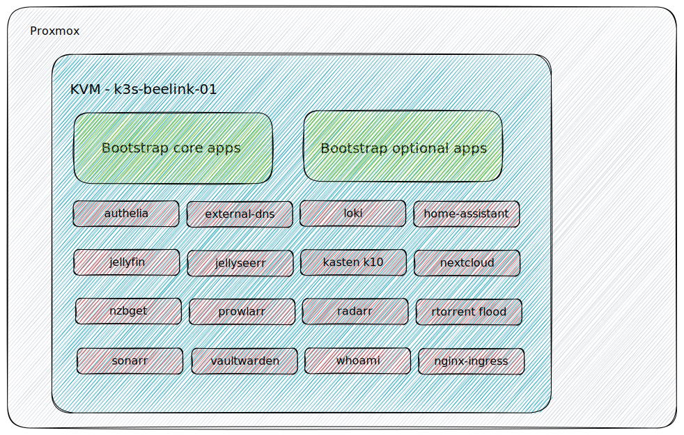

# Installation on beelink sei-12 - nginx ingress
I have a beelink sei12 with 32GB of ram, this comes with an interal ssd ( 500GB ) and ive added a 4TB 2.5" evo ssd in there. This one i ll be setting up with proxmox as it will run a few small other vms besides the kvm that runs homelab. Of that external 4TB ill use 3TB for homelab



since i want to partition the /dev/sda i ll ssh into the server and prepare it
```bash
sudo wipefs --all /dev/sda
```

now I can get ready to start the install 

```bash
./setup install --platform proxmox \
				--email loeken@internetz.me \
				--external_ip 94.134.58.102 \
				--ingress nginx \
				--domain loeken.xyz \
				--cores_k3s 10 \
				--memory_k3s 28672 \
				--cluster-issuer staging \
				--disksize 100GB \
				--interface enp3s0 \
				--kubernetes_version v1.25.6+k3s1 \
				--macaddr 6E:1F:26:B6:DF:20 \
				--proxmox_node_name beelink-sei12 \
				--proxmox_vm_name k3s-beelink-01 \
				--authelia true \
				--externaldns true \
				--ha true \
				--jellyfin true \
				--jellyseerr true \
				--kasten-k10 true \
				--loki true \
				--new_repo loeken/homelab-beelink \
				--nextcloud true \
				--nzbget false \
				--prowlarr true \
				--radarr true \
				--sonarr true \
				--rtorrentflood true \
				--vaultwarden true \
				--ssh_password demotime \
				--ssh_private_key ~/.ssh/id_ed25519 \
				--ssh_public_key ~/.ssh/id_ed25519.pub \
				--ssh_server_address 172.16.137.36 \
				--ssh_server_gateway 172.16.137.254 \
				--ssh_server_netmask 24 \
				--ssh_username loeken \
				--shared_media_disk_size 3000G \
				--shared_media_disk_device sda \
				--partition_external_shared_media_disk true \
				--smtp_domain internetz.me \
				--smtp_host mail.internetz.me \
				--smtp_port 587 \
				--smtp_sender homelab-beelink@internetz.me \
				--smtp_username homelab-beelink@internetz.me \
				--root_password topsecure \
				--storage local-path

```

